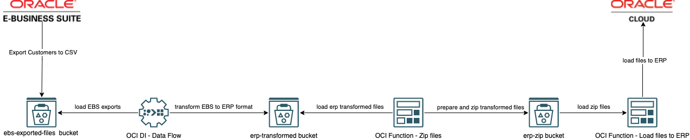

# How to Zip files from an Oracle Cloud Infrastructure Object Storage service bucket, using Oracle Cloud Infrastructure  Functions for Fusion SaaS data load.

## Introduction

This is a sample code for an Oracle Functions written in Golang that can be used in an OCI Data Integration (DI) Pipeline
to zip files generated from an OCI DI Dataflow for Fusion SaaS data load.

## The Solution


For more information please refer to [the blog post](https://www.ateam-oracle.com/post/using-oci-di-and-functions-for-fusion-saas-data-load).

## Services used in this example

* [Oracle Cloud Functions](https://docs.oracle.com/en-us/iaas/Content/Functions/Concepts/functionsoverview.htm)
* [Oracle Cloud Data Integration](https://docs.oracle.com/en-us/iaas/data-integration/using/overview.htm)
* [Oracle API Gateway](https://docs.oracle.com/en-us/iaas/Content/APIGateway/Concepts/apigatewayoverview.htm)

### About Oracle Cloud Functions (Fn)
[Oracle Functions](https://docs.oracle.com/en-us/iaas/Content/Functions/home.htm#top) is a fully managed, multi-tenant, highly scalable, on-demand, Functions-as-a-Service platform. It is built on enterprise-grade Oracle Cloud Infrastructure and powered by the Fn Project open source engine. Use Oracle Functions (sometimes abbreviated to just Functions) when you want to focus on writing code to meet business needs.

### About Oracle Cloud Data Integration

[Data Integration](https://docs.oracle.com/en-us/iaas/data-integration/using/overview.htm) is a fully managed, multi-tenant service that helps data engineers and ETL developers with common extract, transform, and load (ETL) tasks such as ingesting data from a variety of data assets; cleansing, transforming, and reshaping that data; and efficiently loading it to target data assets.

### About Oracle API Gateway

The Oracle API Gateway service enables you to publish APIs with private endpoints that are accessible from within your network, and which you can expose with public IP addresses if you want them to accept internet traffic. The endpoints support API validation, request and response transformation, CORS, authentication and authorization, and request limiting.

## How it works

The function will read the transformed files from the requested bucket, zip the files and upload to the requested bucket.

If the upload process is completed with success the original file is deleted.

## Installation

### Pre-requisites

Ensure Oracle Cloud Functions is installed and that you can deploy a simple Golang based cloud function. If you haven't already installed and configured Oracle Cloud Functions then we can recommend going through the [Oracle Cloud Functions quickstart ](https://www.oracle.com/webfolder/technetwork/tutorials/infographics/oci_faas_gettingstarted_quickview/functions_quickview_top/functions_quickview/index.html) as this will not only help you setup and configure your environment but also show you how to deploy some sample Oracle Cloud Functions.

### Deployment
```
fn deploy --app <app-name>
```

### Request

The expected request payload example :

```
{
  "namespace": "mynamespace",
  "sourceBucketName": "erp-transformed",
  "targetBucketName": "erp-zip",
  "prefix": "ArUpdCustomers"
}
```
**namespace** : bucket namespace

**sourceBucketName** : Transformed file source bucket name

**targetBucketName** : Target bucket name where the zip files are going to be uploaded

**prefix** : Folder name where the files are going to be read and copied from


### Invoke

```
echo -n '{"namespace":"mynamespace","sourceBucketName":"erp-transformed","targetBucketName":"erp-zip","prefix":"ArUpdateCustomer"}' | fn invoke <app-name> zipfiles
```

### Response

Response example :
```
{
  "ProcessedWithSuccess": [
    "customer-import/part-00000-2374e489-0ffd-47d1-8eb8-9eb623d65986-c000.csv"
  ],
  "ProcessedWithError": [
    {
      "Name": "customer-import/part-objecterror.csv",
      "Error": "file error deleting object from original storage"
    }
  ]
}
```
## Security

Oracle takes security seriously and has a dedicated response team for [reporting security vulnerabilities](./SECURITY.md) and to answer any security and vulnerability related questions.

## Contributing

We welcome all contributions to this sample and have a [contribution guide](./CONTRIBUTING.md) for you to follow if you'd like to contribute.

## Help

If you need help with this sample, please log an issue within this repository and the code owners will help out where we can.

## License

*Developers choosing to distribute a binary implementation of this project are responsible for obtaining and providing all required licenses and copyright notices for the third-party code used in order to ensure compliance with their respective open source licenses.*

Copyright (c) 2022, 2024 Oracle and/or its affiliates. 

Released under the Universal Permissive License v1.0 as shown at
<https://oss.oracle.com/licenses/upl/>.
